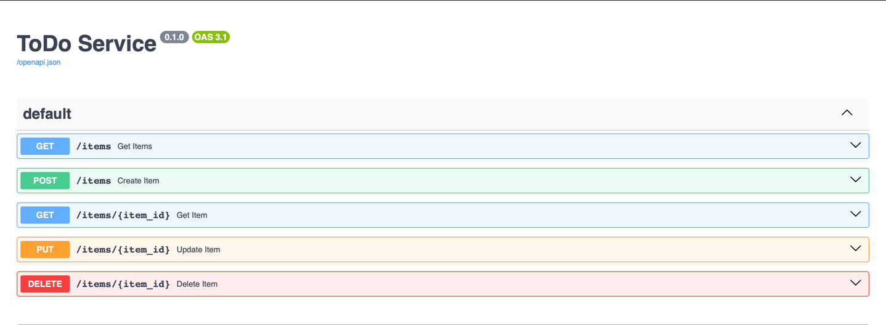
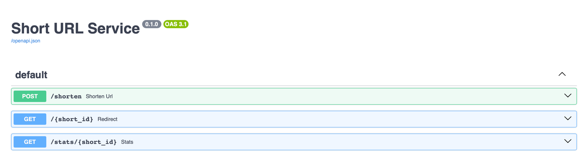

# FastAPI Microservices: ToDo & Short URL

Проект состоит из двух независимых микросервисов, реализованных с использованием **FastAPI**, **SQLite** и **Docker**:

- 📝 **ToDo-сервис** — CRUD-операции для списка задач  
- 🔗 **Сервис сокращения URL** — создание и обработка коротких ссылок  

Каждый сервис:
- является отдельным FastAPI-приложением;
- имеет автоматическую документацию Swagger (`/docs`);
- хранит данные в SQLite;
- упакован в Docker-контейнер с использованием именованных Docker-томов.

---

## 📁 Структура проекта

```text
my-fastapi-project/
│
├── todo_app/
│   ├── main.py
│   ├── requirements.txt
│   └── Dockerfile
│
├── shorturl_app/
│   ├── main.py
│   ├── requirements.txt
│   └── Dockerfile
│
└── README.md
```

---

## 🚀 Шаги выполнения задания

### 1. Разработка ToDo-сервиса

- Создано FastAPI-приложение
- Реализованы эндпоинты:
  - POST /items — создание задачи
  - GET /items — получение всех задач
  - GET /items/{id} — получение задачи по ID
  - PUT /items/{id} — обновление задачи
  - DELETE /items/{id} — удаление задачи
- Используется SQLite
- Таблица создаётся автоматически при запуске
- База данных хранится в Docker-томе

Swagger Docs:  
http://localhost:8000/docs

---

### 2. Разработка сервиса сокращения URL

- Создано отдельное FastAPI-приложение
- Реализованы эндпоинты:
  - POST /shorten — создание короткой ссылки
  - GET /{short_id} — редирект
  - GET /stats/{short_id} — информация о ссылке
- Используется SQLite
- Таблица создаётся автоматически при запуске
- Данные сохраняются в Docker-томе

Swagger Docs:  
http://localhost:8001/docs

---

### 3. Dockerизация сервисов

Для каждого сервиса:
- написан Dockerfile;
- зависимости устанавливаются через requirements.txt;
- объявлен том `/app/data`;
- приложение запускается на порту 80 через Uvicorn.

---

### 4. Сборка Docker-образов

```bash
docker build -t abiimarik/todo-service:latest todo_app/
docker build -t abiimarik/shorturl-service:latest shorturl_app/
```

---

### 5. Создание Docker-томов

```bash
docker volume create todo_data
docker volume create shorturl_data
```

---

### 6. Запуск контейнеров

```bash
docker run -d -p 8000:80 -v todo_data:/app/data abiimarik/todo-service:latest
docker run -d -p 8001:80 -v shorturl_data:/app/data abiimarik/shorturl-service:latest
```

---

## 🔍 Проверка работоспособности

### ToDo-сервис
1. Создать задачу через POST /items
2. Получить список через GET /items
3. Перезапустить контейнер
4. Убедиться, что данные сохранились

### Сервис сокращения URL
1. Создать ссылку через POST /shorten
2. Проверить редирект через GET /{short_id}
3. Получить статистику через GET /stats/{short_id}
4. Перезапустить контейнер и убедиться в сохранности данных

---

## 🐳 Публикация образов в Docker Hub

```bash
docker login
docker push abiimarik/todo-service:latest
docker push abiimarik/shorturl-service:latest
```

---

## ✅ Итог

- ✔ Два FastAPI-микросервиса  
- ✔ SQLite + Docker volumes  
- ✔ Swagger-документация  
- ✔ Готово для GitHub и Docker Hub  



